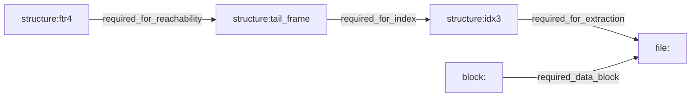

<!--
SPDX-License-Identifier: CC-BY-4.0
SPDX-FileCopyrightText: 2026 Richard Majewski
-->

# Corruption Propagation Graph v1 (`crushr-info --json --report propagation`)

This contract defines a deterministic explanatory graph for minimal-v1 archives.

## Scope

Applies to minimal-v1 extraction scope and includes structurally corrupted archives via bounded fallback inspection when `open_archive_v1` fails:

- regular files
- required structures: `FTR4` footer, tail frame, `IDX3` index bytes
- required file data blocks referenced by the index

It is explanatory and bounded. It is **not** a repair, reconstruction, or recovery plan.

## Command surface

- `crushr-info <archive> --json --report propagation`

The output is a single JSON report object, not a snapshot envelope.

## Semantics

- **Direct dependency**: encoded as an edge (`from` -> `to`) with a bounded reason.
- **Propagated impact**: per-file impact causes resulting from corruption of required structures/blocks.
- **Actual impact**: subset of per-file causes that match currently detected corrupted structures and blocks.

### Minimal-v1 dependency chain

## Deterministic ordering requirements

For identical archive bytes, report JSON is deterministic:

- `nodes`: structure nodes first (`ftr4`, `tail_frame`, `idx3`), then blocks ascending by block id, then files ascending by path
- `edges`: sorted by `from`, then `to`, then reason rank
- `per_file_impacts`: sorted by `file_path`
- block lists: ascending numeric order

## Report fields

- `report_version`: currently `1`
- `format_family`: currently `"minimal-v1"`
- `report_kind`: currently `"corruption_propagation_graph"`
- `corrupted_structure_nodes`: deterministic list of currently detected corrupted required structure node ids
- `corrupted_blocks`: deterministic list of corrupted block ids
- `nodes`: deterministic node list
- `edges`: deterministic dependency list
- `per_file_impacts`: one entry per regular file
  - `required_nodes`: all required structures and required blocks for that file
  - `hypothetical_impacts_if_corrupted`: full bounded cause list for the file
  - `actual_impacts_from_current_corruption`: causes active for the current corruption state

## Node ids and kinds

Node ids are stable, explicit labels:

- `structure:ftr4` (`footer`)
- `structure:tail_frame` (`tail_frame`)
- `structure:idx3` (`index`)
- `block:<id>` (`block`)
- `file:<stored path>` (`file`)

## Dependency reasons

Bounded values:

- `required_for_reachability`
- `required_for_index`
- `required_for_extraction`
- `required_data_block`

## Impact reasons

Bounded values:

- `corrupted_required_structure`
- `corrupted_required_block`

## Limits and non-inferences

- This contract does not imply availability of recovery/repair/reconstruction paths.
- It does not estimate partial-byte survivability.
- It does not include speculative future format features (multi-block redesign, DCT1/LDG1 semantics expansion, metadata fidelity, streaming).
- It must stay consistent with implemented extraction refusal behavior for the same corruption causes.
