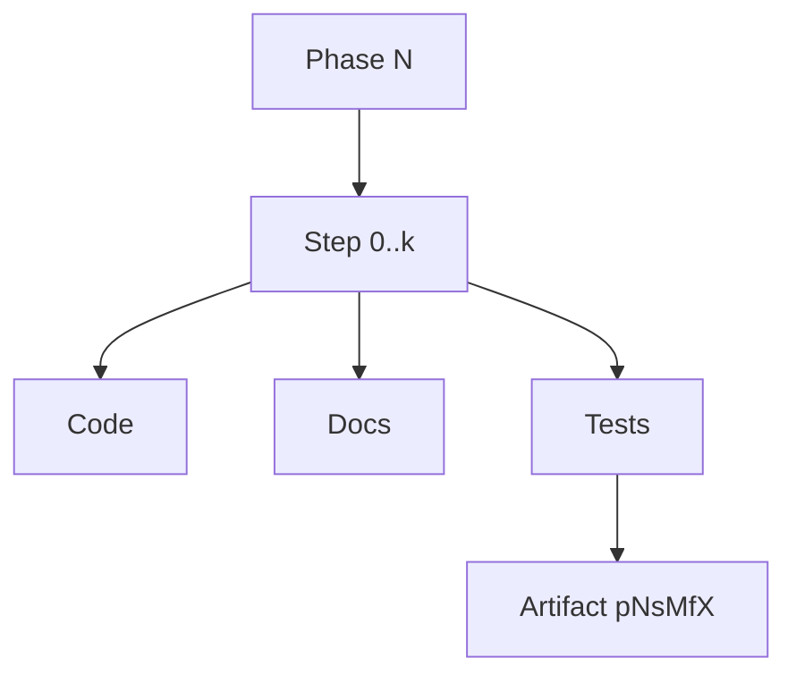

# Phase + Steps Plan (Work Tracking)

This file is intentionally internal (not MkDocs). It defines the implementation sequence and work packaging expectations.

## Next Phases (High Level)

### Phase 1 — Re-introduce removed architecture features
- Format v3 (BLK3 + DCT1 + FTR3)
- Multiple dictionaries (grouped, deterministic)
- Redundant footer copies (recovery)

### Phase 2 — UI2 live wiring + operational polish
- Live progress for large archives
- `info` extensibility
- man pages

### Phase 3 — Tuning upgrades
- Stratified sampling
- Time-budgeted autotune improvements
