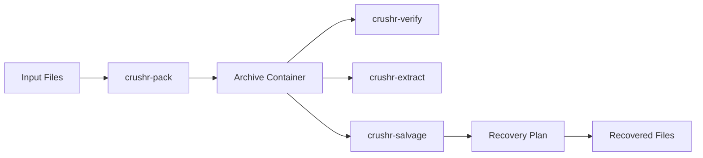
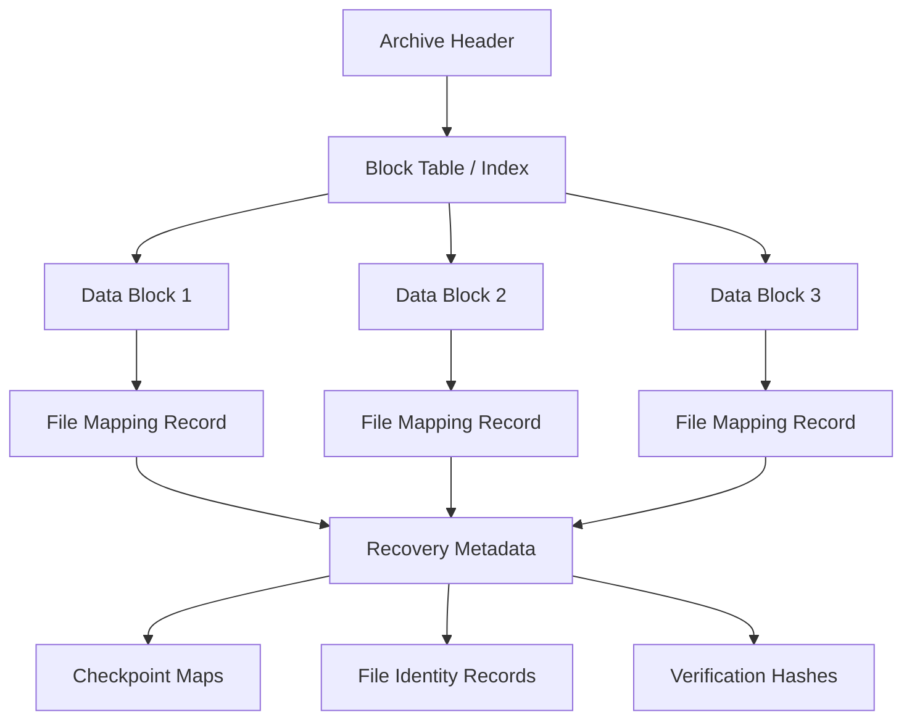

# crushr


**crushr** is an experimental, integrity-first archival and compression format designed around a different premise than traditional archive tools:

> When corruption occurs, the system should maximize what can still be _proven and recovered_.

Most archive formats assume the archive structure will remain intact. When structural metadata becomes damaged, extraction usually fails completely.

crushr explores a different design space: **archive formats designed to degrade gracefully and enable deterministic salvage of surviving data.**

---

# What Makes crushr Different

crushr is not designed primarily for convenience. Instead it focuses on:

• **Integrity-first archive design**  
• **Deterministic recovery semantics**  
• **Redundant metadata surfaces**  
• **Cryptographic verification of recovered data**  
• **Empirical corruption testing and salvage experimentation**

The goal is not merely to store files efficiently, but to make archives **recoverable even when parts of the structure are damaged.**

---

# Quick Examples

### Pack files into an archive

```
crushr-pack input_dir -o archive.cr
```

### Verify archive integrity

```
crushr-verify archive.cr
```

### Extract archive contents

```
crushr-extract archive.cr -o output_dir
```

### Attempt recovery from a damaged archive

```
crushr-salvage damaged_archive.cr
```

The salvage tool analyzes surviving structures and produces a recovery plan based on verified data.

---

# Build From Source

```
git clone https://github.com/<your-org>/crushr
cd crushr
cargo build --release
```

Binaries will appear in:

```
target/release/
```

Primary tools:

```
crushr-pack
crushr-extract
crushr-verify
crushr-salvage
```

---

# Architecture Overview



crushr is built around block-level verification and redundant metadata surfaces that enable recovery tools to reconstruct file mappings even when canonical indexes are damaged.



---

# Design Philosophy

The central thesis of crushr is:

**Recoverability under corruption should be treated as a first-class property of archive formats.**

Traditional archive systems rely heavily on a single authoritative metadata structure such as a central directory or index. When that structure is damaged, the archive often becomes unusable.

crushr experiments with designs that distribute verifiable information throughout the archive so that recovery tools can reconstruct structure even when canonical metadata is lost.

---

# Core Design Principles

## Block-Structured Data

Archive payloads are divided into independently identifiable blocks. Each block can be verified using cryptographic hashes.

This allows salvage tools to validate recovered fragments without requiring a global index.

## Redundant Metadata Surfaces

Multiple metadata layers may describe file-to-block mappings, including:

• canonical indexes  
• distributed checkpoints  
• file identity records  
• path maps and manifests

These redundant signals allow reconstruction of archive structure when some metadata is missing.

## Deterministic Verification

All recovery paths must ultimately verify data through cryptographic hashes.

The system prefers **provable recovery** over speculative reconstruction.

## Salvage-First Tooling

crushr includes dedicated tooling designed to analyze damaged archives and construct deterministic recovery plans.

---

# Example Salvage Output

When corruption is detected, the salvage tool produces a structured recovery plan.

Example (simplified):

```
SALVAGE REPORT
---------------
Files discovered: 42
Files fully recoverable: 38
Files partially recoverable: 3
Files unrecoverable: 1

Recovered blocks verified via BLAKE3.
Recovery plan written to salvage_plan.json
```

Recovered files can then be reconstructed using only verified blocks.

---

# Experimental Recovery Research

crushr includes a corruption-testing and comparison framework used to evaluate recovery strategies.

Different archive layouts and metadata strategies can be tested under controlled corruption scenarios. Results are compared to determine which approaches improve recoverability.

Rather than relying purely on theory, the format evolves through **empirical experimentation.**

---

# Intended Use Cases

crushr is most relevant where **recoverability and verifiability matter more than convenience**.

Potential use cases include:

• long-term research data preservation  
• forensic evidence containers  
• archival storage systems  
• reproducible artifact storage  
• integrity-focused backup pipelines

In these environments the ability to recover _some verified data_ from a damaged archive can be more valuable than an all-or-nothing design.

---

# What crushr Is Not

crushr is **not intended to replace mainstream archive formats** like ZIP or TAR for everyday workflows.

Those formats are optimized for:

• compatibility  
• ecosystem support  
• simplicity

crushr instead explores a specialized design space centered on **archival resilience and deterministic recovery.**

---

# Repository Structure

```
crates/
    crushr-core        core archive primitives
    crushr-pack        archive creation
    crushr-extract     strict extraction implementation
    crushr-verify      archive integrity verification
    crushr-salvage     archive recovery tooling
    crushr-lab-*       experimental research tooling

docs/
    ARCHITECTURE.md
    SPEC.md
```

The repository contains both production tools and experimental research tooling used to evaluate archive recovery strategies.

---

# AI-Assisted Development

crushr is being developed through an open **human–AI engineering collaboration**.

AI systems are used to:

• assist with implementation  
• explore architectural alternatives  
• generate structured development packets  
• perform hostile peer review  
• help maintain documentation and design consistency

The human developer retains architectural authority, validation responsibility, and final decision making.

The project therefore serves as a case study in **AI-assisted systems engineering**, where AI acts as a development partner rather than a simple code generator.

---

# Project Status

crushr is an active experimental project.

Current development focuses on:

• archive format iteration  
• recovery model experimentation  
• corruption testing  
• salvage algorithm refinement  
• repository boundary hardening

Future work will determine which experimental mechanisms become permanent parts of the format specification.

---

# Long-Term Vision

The long-term goal of crushr is to produce:

1. a stable integrity-first archival format
2. a robust salvage and verification toolchain
3. a documented case study in AI-assisted systems development

Even if crushr ultimately remains a niche format, the project aims to contribute useful ideas to the broader discussion around archival resilience and data integrity.

---

# Summary

crushr is an experimental archive format designed to answer a different question than traditional compression tools:

> What should an archive system do when corruption is expected rather than exceptional?

By treating recoverability as a primary design goal, crushr explores how archive formats can degrade gracefully and preserve verifiable data even under structural damage.

The project also demonstrates how complex systems engineering projects can be developed through structured collaboration between human developers and AI systems.