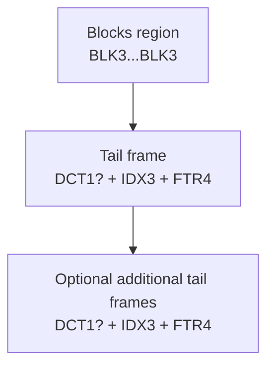

# crushr Archive Format v1.0

This document is the canonical on-disk format contract for `crushr`.

## Scope

- Defines the byte-level archive layout.
- Defines required verification semantics.
- Defines portability guarantees for stored metadata.

Non-goals:
- CLI/TUI UX. Those live in tool-specific docs.
- Filesystem policy (how to map OS metadata to the format). That lives in `crushr` crate docs.

## Compatibility policy

- **v1.0 archives use BLK3 / IDX3 / DCT1 / FTR4.**
- Pre-v1.0 prototype archives are **not** guaranteed readable by v1.0 tools.
- A future "compat" feature may be added, but it is not part of the v1.0 contract.

## File layout overview

An archive is a blocks region followed by one or more tail frames. The last valid tail frame is authoritative.

### Terminology

- **Block**: a self-contained compressed payload with a header (BLK3).
- **Index (IDX3)**: file table + extent map referencing blocks.
- **Dictionary table (DCT1)**: optional embedded dictionaries referenced by blocks.
- **Footer (FTR4)**: offsets/lengths for the tail frame plus integrity hashes.
- **Tail frame**: `DCT1?` + `IDX3` + `FTR4` (in that order).

## Encoding

- All integers are **little-endian**.
- Offsets are **absolute file offsets** from the start of the archive.
- Hashes use **BLAKE3**, 32 bytes.

## BLK3: Block format

Blocks are the fundamental unit of random access.

### BLK3 header

All fields are little-endian.

| Field | Type | Notes |
|---|---:|---|
| magic | [u8;4] | ASCII `BLK3` |
| header_len | u16 | Total header length in bytes (>= fixed header) |
| flags | u16 | See flags table |
| codec | u32 | `1 = zstd` (others reserved) |
| level | i32 | codec-specific compression level |
| dict_id | u32 | `0 = none`, otherwise references DCT1 entry |
| raw_len | u64 | Uncompressed payload length |
| comp_len | u64 | Compressed payload length |
| payload_hash | [u8;32]? | Present if `HAS_PAYLOAD_HASH` |
| raw_hash | [u8;32]? | Present if `HAS_RAW_HASH` (optional/expensive) |
| reserved/padding | bytes | Pad to `header_len` |

Immediately after the header:

- `payload`: `comp_len` bytes

### BLK3 flags

| Flag | Bit | Meaning |
|---|---:|---|
| HAS_PAYLOAD_HASH | 0 | `payload_hash` present (BLAKE3 of compressed payload bytes) |
| HAS_RAW_HASH | 1 | `raw_hash` present (BLAKE3 of uncompressed payload bytes) |
| USES_DICT | 2 | `dict_id != 0` and dictionary must be present in DCT1 |
| IS_META_FRAME | 3 | Payload contains non-user data (e.g., EVT frames). Semantics are tool-defined. |

### BLK3 invariants

- `header_len` MUST be large enough to contain all present fields.
- `comp_len` MUST match the following payload byte count.
- If `USES_DICT` is set, `dict_id` MUST be non-zero.
- If `HAS_PAYLOAD_HASH` is set, readers MUST verify it during `verify --deep`.

## DCT1: Dictionary table

The dictionary table is optional. It MUST be present if any block sets `USES_DICT`.

### DCT1 layout

| Field | Type | Notes |
|---|---:|---|
| magic | [u8;4] | ASCII `DCT1` |
| count | u32 | Number of dictionaries |
| entries | ... | Repeated `count` times |

Each entry:

| Field | Type | Notes |
|---|---:|---|
| dict_id | u32 | Must be non-zero |
| dict_len | u32 | Byte length |
| dict_hash | [u8;32] | BLAKE3 of dict bytes |
| dict_bytes | [u8;dict_len] | Raw dictionary bytes |

### DCT1 invariants

- `dict_id` values must be unique within the table.
- Readers MUST verify `dict_hash` before using a dictionary.

## IDX3: Index

IDX3 is the canonical index encoding for v1.0.

- The precise IDX3 layout is defined by the `crushr-format` crate.
- IDX3 MUST be fully validated on load (structural checks; no trailing bytes).
- Index entries reference blocks via extents: `(block_id, block_offset, len)`.

### Metadata portability

IDX3 may store:

- POSIX-like metadata: mode bits, mtime, uid/gid (if captured)
- xattrs (optional)

Portability rules:

- Writers MAY store metadata on any platform.
- Extractors apply metadata on a **best-effort** basis on non-Unix platforms.
- Any metadata that cannot be applied MUST be reported (and optionally emitted in JSON output).

## FTR4: Tail footer

The footer anchors a tail frame and provides integrity verification.

### FTR4 layout

| Field | Type | Notes |
|---|---:|---|
| magic | [u8;4] | ASCII `FTR4` |
| version | u32 | Must be `1` |
| flags | u32 | Reserved (0 for now) |
| blocks_end_offset | u64 | Offset immediately after last block payload |
| dct_offset | u64 | 0 if no DCT1 |
| dct_len | u64 | 0 if no DCT1 |
| index_offset | u64 | Absolute offset to IDX3 |
| index_len | u64 | Byte length |
| index_hash | [u8;32] | BLAKE3 of IDX3 bytes |
| footer_hash | [u8;32] | BLAKE3 of footer fields excluding `footer_hash` |
| reserved | bytes | Pad to a fixed size (implementation-defined; recommend 128 bytes total) |

### FTR4 invariants

- `index_offset + index_len` MUST be within file bounds.
- `dct_offset + dct_len` MUST be within file bounds if `dct_offset != 0`.
- `blocks_end_offset` MUST be <= `min(dct_offset, index_offset)` for the tail frame.
- Readers MUST verify `index_hash` on open.

## Tail frame selection rules

- Tools locate the end of file, read a candidate FTR4, and validate it.
- If invalid, open fails deterministically.
- The **last valid** FTR4 is authoritative.

## Verification semantics

Two primary modes:

- **Fast verify**: validate footer + index hash + index structural checks.
- **Deep verify**: additionally validate per-block payload hashes (and raw hashes if present), and ensure referenced extents are in-bounds.

## Append semantics

Appending creates a new tail frame:

1. Read and validate the last tail frame.
2. Truncate the file to `blocks_end_offset`.
3. Append new BLK3 blocks.
4. Write updated DCT1 (if needed), then IDX3, then FTR4.
