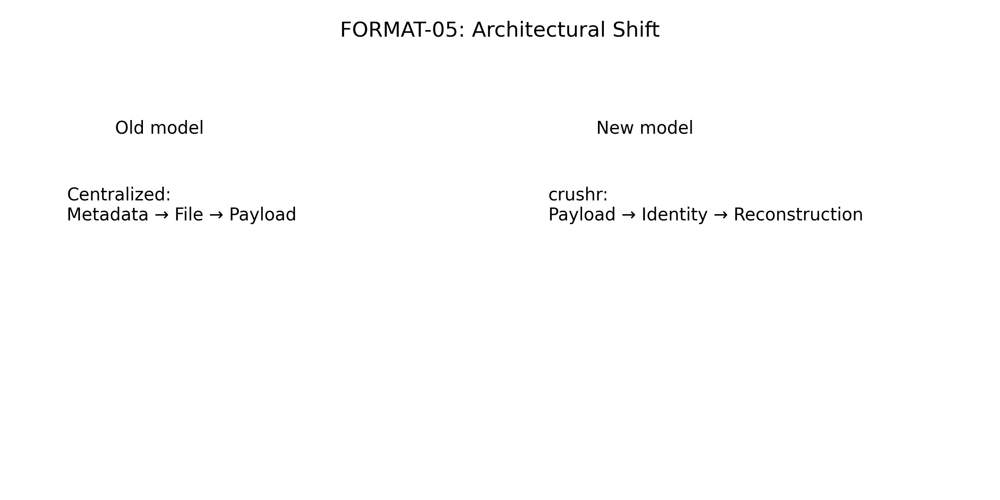
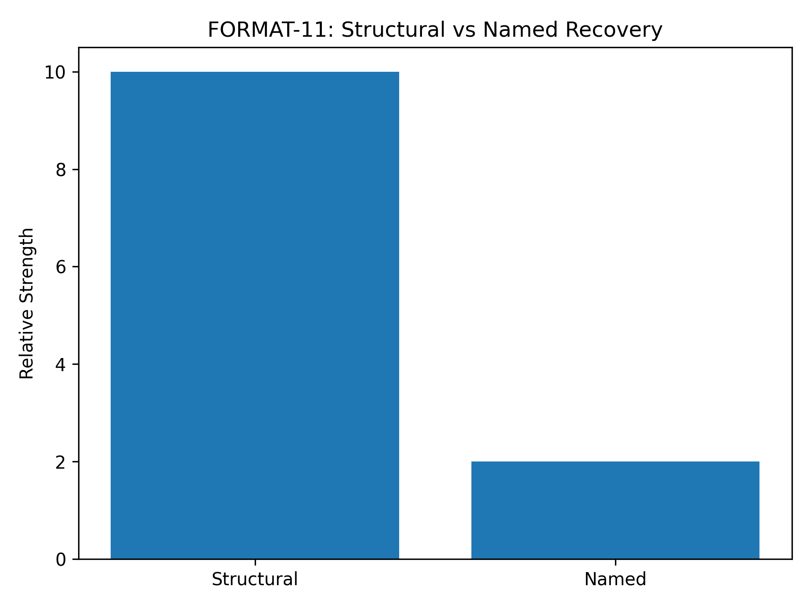
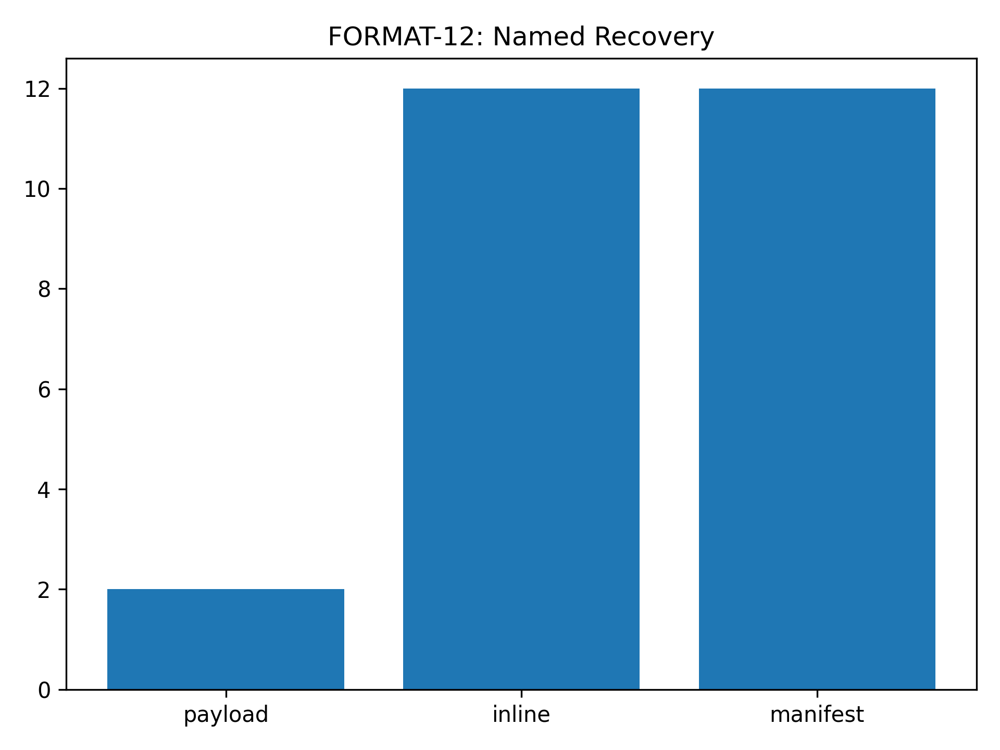
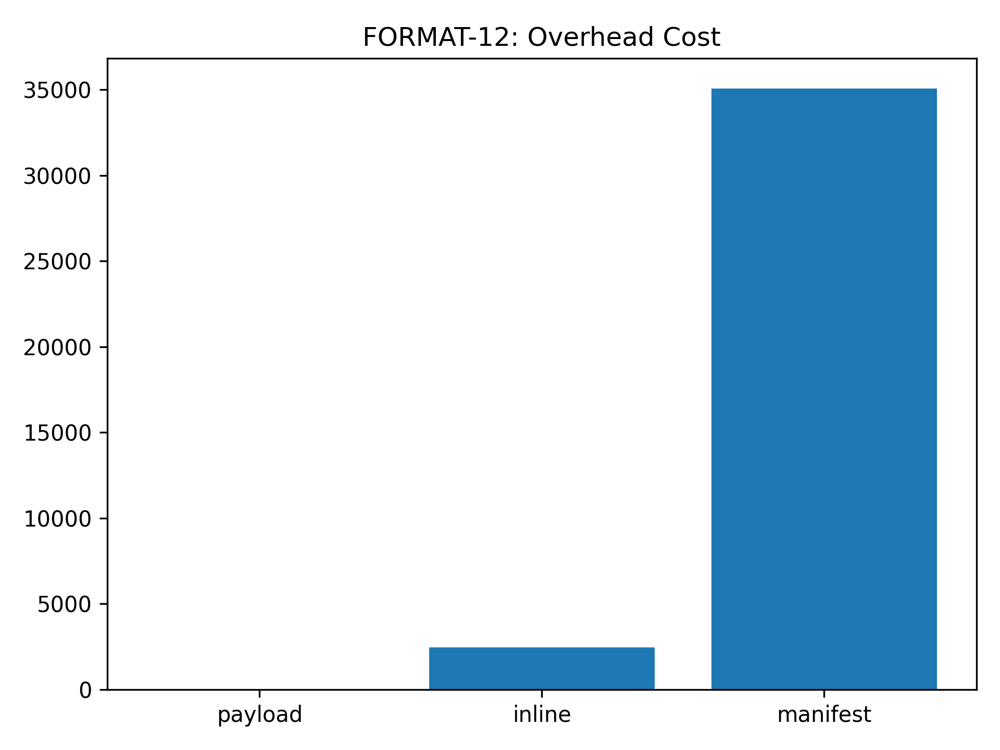
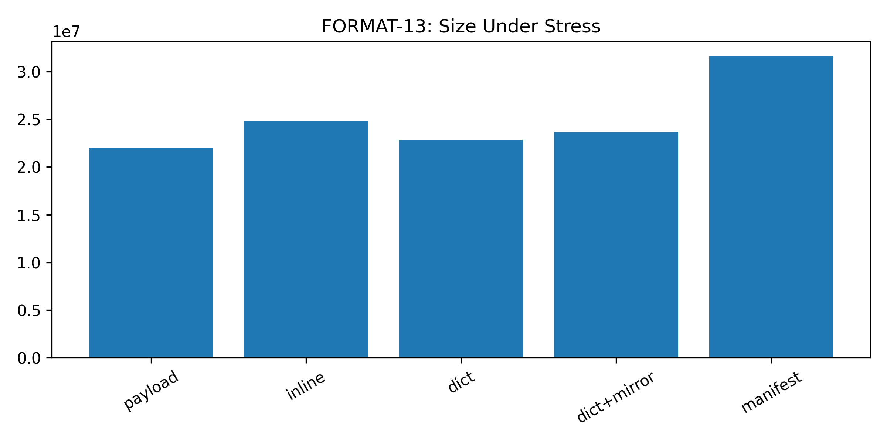
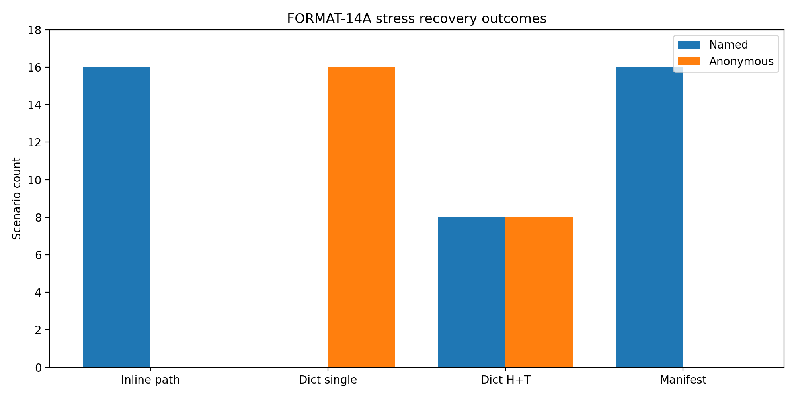

# Format evolution

<strong>This page explains selection, not chronology.</strong> The point is not that time passed; the point is that multiple plausible design branches were tested and only a subset survived repeated corruption experiments.

The story of crushr is not a straight line. It is a branching selection process in which multiple architectural ideas were tested under corruption and only a subset survived.

  
  
A better representation than a linear timeline: the current architecture emerged by eliminating weaker branches.

## Milestone summary

| Experiment | Main question | Outcome |
|---|---|---|
| FORMAT-05 | Can payload blocks become self-identifying enough to improve salvage? | Yes. This became the foundational architectural pivot. |
| FORMAT-07 | Can salvage reason over verified relationships rather than flat metadata? | Yes. Recovery classification became more explicit and defensible. |
| FORMAT-08 | Do metadata placement strategies materially change survivability? | No. Fixed, hash, and golden placement were effectively tied. |
| FORMAT-09 / 10 | Do heavier metadata surfaces survive enough to justify their cost? | Largely no. Manifest-heavy paths remained expensive and less useful than hoped. |
| FORMAT-11 | Is distributed extent identity sufficient on its own? | Structurally yes, but not enough for strong named recovery. |
| FORMAT-12 | Can inline naming recover names without manifest-level overhead? | Yes, but repeated strings created measurable cost. |
| FORMAT-13 | Can dictionary indirection retain recovery and reduce size? | Yes. Header+tail dictionary mirroring emerged as the best balance. |
| FORMAT-14A | Does direct dictionary corruption validate the mirrored strategy? | Yes. Single dictionary was too fragile; header+tail behaved correctly. |

## Older phase visuals

### FORMAT-05 — the first architectural shift

  
  
The earliest pivot: truth moved toward the payload instead of remaining entirely metadata-centric.

### FORMAT-11 — structural recovery without strong naming

  
  
FORMAT-11 proved distributed structural identity was cheap and useful, but not sufficient for strong named recovery on its own.

### FORMAT-12 — naming restored, overhead exposed

  

  
  
Inline naming was the bridge architecture: it restored names cheaply relative to manifests, but its duplication cost justified further optimization.

### FORMAT-13 — dictionary indirection under stress

  
  
The stress runs made the size hierarchy clear: dictionary indirection preserved the recovery model while materially reducing overhead.

### FORMAT-14A — resilience under direct dictionary-target corruption

  
  
The decisive result: header+tail dictionary mirroring preserved named recovery when one copy survived and fell back anonymously when both were unavailable.

### FORMAT-15 — refinement without promotion

FORMAT-15 explored two refinements to the winning mirrored-dictionary design:

- generation-aware dictionary identity
- factored namespace dictionaries

The submitted results were clear enough to make a decision.

On the baseline corpus, the factored variant preserved the same recovery behavior as `extent_identity_path_dict_header_tail` but increased archive size by 1,512 bytes.

On the stress corpus, it again preserved the same recovery behavior but increased archive size by 50,988 bytes.

That makes FORMAT-15 a useful negative result. The optimization attempt did not beat the current winner, so the lead architecture remains the non-factored header+tail mirrored dictionary model.
