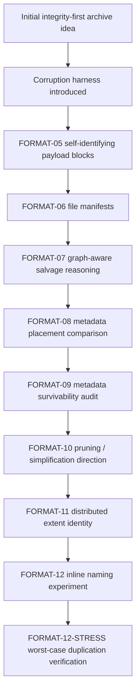

# Format Evolution

crushr is moving quickly, so this page is intended as a living map rather than a frozen history.

The short version is:

> crushr started as an integrity-first archive format and is evolving into an **integrity-first, salvage-aware archive design** where the strongest durable truth lives as close to the payload as possible, and heavier metadata is kept only if the corruption harness proves it earns its keep.

This page exists to help readers understand how the format changed, what the harness proved, and why the current direction looks the way it does.

## The original assumption

The early design assumption was familiar to anyone who has worked with archives:

```text
archive integrity depends on metadata integrity
metadata corruption causes recovery failure
```

That assumption is reasonable because it describes how many traditional archive containers behave in practice.

The original goal of crushr was therefore framed around **perfect integrity** in the conventional sense.

## The turning point

Once the corruption harness was in place, the project stopped being driven only by theory.

Instead, crushr began evolving through repeated destructive tests:

1. build deterministic archive variants
2. corrupt them in controlled ways
3. measure what still survives
4. keep what helps
5. cut what does not

That process changed the architecture.

## Evolution timeline



## Phase-by-phase evolution

### Early phase — integrity-first container thinking

At the start, crushr looked more like a traditional archival design problem:

- protect metadata
- duplicate metadata
- make the container robust
- recover files from preserved structural information

This phase was important because it established the baseline assumptions that the harness later challenged.

### FORMAT-05 — self-identifying payload blocks

This was the major architectural shift.

Payload blocks gained enough local truth to be independently identified and verified.

That meant recovery no longer had to start from a surviving index. Salvage could begin with the payload itself.

**What changed conceptually**

```text
old model:
metadata -> file structure -> payload

new model:
payload truth -> reconstruction -> metadata as supporting evidence
```

**What the harness showed**

This phase produced the first major recovery improvement. It was the point where crushr stopped looking like “archive with better metadata” and started looking like “archive where the data can still explain itself after damage.”

### FORMAT-06 — file manifests

This phase added file-level truth so the system could better reason about:

- file completeness
- expected extent count
- stronger recovery confidence

**What changed conceptually**

FORMAT-06 did not replace FORMAT-05. It layered file-level structure on top of block-level truth.

**What the harness showed**

FORMAT-06 improved confidence and verification detail more than it improved top-line recovery counts. That was still useful: not every phase needs to create dramatic jumps if it sharpens what the system can prove.

### FORMAT-07 — graph-aware salvage reasoning

This phase changed the reasoning model.

Instead of flat metadata checks, salvage began reasoning over surviving verified relationships:

- block belongs to extent
- extent belongs to file
- file links to name/path if that truth survives

**What changed conceptually**

Recovery classes became more explicit and defensible. The system could explain not just *what* was recovered, but *why that level of recovery was justified*.

### FORMAT-08 — metadata placement comparison

This phase tested three metadata placement strategies:

- `fixed_spread`
- `hash_spread`
- `golden_spread`

The expectation was that better placement might improve metadata survivability.

**What the harness showed**

All three strategies produced effectively identical results.

That suggested placement was not the real issue.

### FORMAT-09 — metadata survivability and necessity audit

This phase asked the blunt question:

> Do the extra metadata layers actually survive enough to matter?

**What the harness showed**

The answer was stark:

- manifest checkpoint survival stayed at or near zero
- path checkpoint survival stayed at or near zero
- verified metadata node count stayed at or near zero

This strongly suggested that the current metadata layers were not driving resilience.

### FORMAT-10 — pruning and simplification direction

FORMAT-10 turned the FORMAT-09 findings into an explicit design challenge.

Instead of assuming every metadata surface deserved to remain because it seemed useful in theory, the project began comparing stripped-down variants against manifest-bearing and full experimental designs.

**What changed conceptually**

The design question shifted from:

```text
how do we protect more metadata?
```

to:

```text
which metadata surfaces are actually worth carrying at all?
```

**What the harness showed**

FORMAT-10 reinforced a now-recurring pattern:

- manifest-bearing variants still materially helped named recovery
- broader experimental metadata caused very large size overhead
- weak or partial metadata layers did not justify themselves just by existing

That moved the project toward a more selective keep/demote/prune mindset.

### FORMAT-11 — distributed extent identity

FORMAT-11 tested a more radical hypothesis.

Instead of relying on a larger centralized naming or manifest structure, the archive could carry stronger structural identity locally with each extent.

The key experimental arm was:

- `extent_identity_only`

This variant was intentionally anonymous by design. It focused on distributed structural truth rather than human-meaningful naming.

**What changed conceptually**

FORMAT-11 asked whether the archive could keep the cheap survivability benefits of local identity without paying the size cost of manifest-heavy designs.

It separated two questions that had been getting blurred together:

- can the archive still prove what surviving extents belong together?
- can it still recover user-meaningful file naming?

Those are not the same requirement.

**What the harness showed**

FORMAT-11 produced a useful but limited result:

- `extent_identity_only` stayed very close to `payload_only` on size
- `extent_identity_only` did **not** materially improve named recovery over `payload_only`
- manifest-bearing variants still dominated on named recovery
- distributed extent identity looked cheap enough to remain interesting as a salvage aid, but not as a drop-in replacement for naming metadata

In practical terms, FORMAT-11 showed that local structural identity is cheap, but anonymous structural identity alone does not buy back the naming benefits of manifests.

## What the project learned

The experiments so far point to a simple but important conclusion:

```text
traditional metadata is not the main resilience mechanism in crushr
self-identifying payload truth is
```

That does **not** mean metadata is useless.

It means metadata appears to be:

- optional support
- helpful for confidence and naming when it survives
- not the primary source of recoverability

It also means the term “metadata” needs to be treated more carefully.

At this stage the project has to distinguish between:

- **structural identity** needed to verify and group surviving data
- **naming/path truth** needed for human-meaningful recovery
- a broader **Unix metadata envelope** such as mode, uid, gid, mtime, xattrs, and related policy

Those layers should not be treated as one undifferentiated blob.

## Current direction

The format is now moving toward a more minimal, evidence-driven architecture.

The working model looks like this:

```text
minimal container framing
+ self-identifying payload blocks
+ salvage reasoning
+ distributed structural identity where it proves worth
+ only the naming/metadata surfaces that survive enough to justify their byte cost
```

This is a major refinement of the original mission.

The original goal was perfect integrity.

The newer, more realistic formulation is:

> Preserve perfect integrity for whatever survives, and recover only what can still be proven.

## Why this matters

This direction is unusual for archive formats.

Traditional archive design usually assumes that metadata must remain authoritative.

crushr is increasingly exploring a different principle:

> data should carry enough truth to survive structural failure.

That is the core reason the project is interesting.

At the same time, crushr is still a compression-oriented archive format, not merely a forensic container.

That means size overhead remains a first-class design constraint. A recovery feature that inflates the archive enough to undermine the format’s compression credibility has to clear a much higher bar.

## What comes next

The next major question is no longer simply “how do we add more metadata?”

After FORMAT-11, the sharper question is:

- can distributed naming restore named recovery without the size blow-up of manifest-heavy variants?
- if names and paths are the one thing metadata is still buying, can that truth be distributed locally instead of centralized?
- how much duplication is too much before the format stops looking credible as a compression-oriented design?

That was the purpose of FORMAT-12, and FORMAT-12-STRESS closes the remaining duplication-risk question with deterministic stress datasets.

FORMAT-12/12-STRESS compare at least:

- `payload_only`
- `extent_identity_only`
- `payload_plus_manifest`
- `full_current_experimental`
- `extent_identity_inline_path`
- `extent_identity_path_dict_single`
- `extent_identity_path_dict_header_tail`
- `extent_identity_path_dict_quasi_uniform`

and answer whether embedding name/path truth into local extent identity buys enough named recovery to justify its byte cost.

FORMAT-12-STRESS adds deterministic worst-case dataset families (`deep_paths`, `long_names`, `fragmentation_heavy`, `mixed_worst_case`) and records stress metrics including path lengths, extent density, and bytes added per extent/path-character in `format12_stress_comparison_summary.{json,md}`.

If it does, that points toward a retained distributed naming surface.
If it does not, that strengthens the case for pruning or demoting naming-heavy metadata rather than carrying it on principle.

## Reading this page later

This page will need regular updates. The format is evolving quickly, and some current conclusions may be refined or overturned by later data.

That is expected.

The important thing is that crushr is not being shaped by attachment to earlier assumptions. It is being shaped by what survives the harness.

## Read next

For the mechanics behind these results, continue to [Testing Harness](testing-harness.md).

## FORMAT-14A — dictionary-target resilience validation

FORMAT-14A extends the deterministic harness with dictionary-target corruption scenarios focused on dictionary-based identity variants.

- Added targets: `primary_dictionary`, `mirrored_dictionary`, `both_dictionaries`, `inconsistent_dictionaries`.
- Added commands: `run-format14a-dictionary-resilience-comparison` and `run-format14a-dictionary-resilience-stress-comparison`.
- Required artifacts: `format14a_dictionary_resilience_summary.{json,md}` and `format14a_dictionary_resilience_stress_summary.{json,md}`.

The packet is explicitly bounded to resilience/fail-closed behavior under dictionary corruption and does not include namespace-factorization or dictionary size redesign work.
