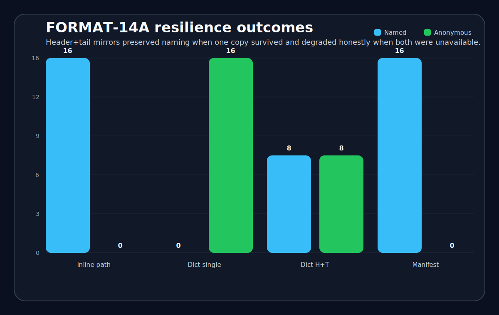

# Dictionary system

The dictionary subsystem provides naming truth. It is intentionally separate from structural truth so that loss of naming proof does not erase useful verified payload.

## Current model

crushr uses two dictionary copies:

- one near the header
- one near the tail

This yields three useful operating states.

| State | Result |
|---|---|
| One valid copy survives | Named recovery remains possible |
| Both copies unavailable | Recovery downgrades to anonymous mode |
| Copies conflict | Naming fails closed |

## Resolution policy

The dictionary subsystem is not allowed to guess. A surviving copy must be structurally valid, belong to the current archive, and pass the archive’s conflict policy. If the policy cannot prove which naming surface is authoritative, naming is refused.

  
  
Header+tail mirrors preserved named recovery when one copy survived and degraded honestly when both were unavailable or in conflict.

