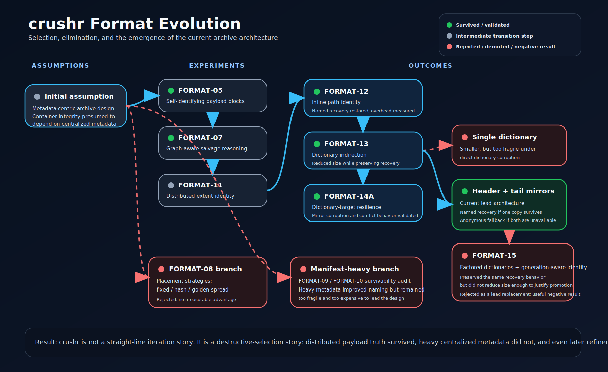

<!--
SPDX-License-Identifier: CC-BY-4.0
SPDX-FileCopyrightText: 2026 Richard Majewski
-->

# crushr

crushr is a **salvage-oriented archival format** built for the failure case, not merely the happy path. It addresses a narrow but serious systems question:

> When an archive is damaged, what can still be proven and recovered without guessing?

| Perspective | Current answer |
|---|---|
| Format stance | Integrity-first archive semantics with deterministic salvage classification |
| Architectural core | Distributed extent identity plus mirrored naming dictionaries |
| Trust boundary | Fail-closed naming with anonymous fallback when proof is unavailable |
| Selection method | Deterministic corruption experiments, not speculative design preference |

crushr’s architecture emerged through elimination. Several plausible branches were tested; only the branches that survived repeated corruption experiments remained in the mainline design.

## What makes crushr materially different

Most archive formats assume the container remains structurally intact. crushr assumes that real failure is uglier than that and treats post-damage reasoning as part of the design, not as a separate apology after extraction fails.

!!! note "Key differences"
    - **Distributed identity** keeps the strongest durable truth with the extents themselves rather than in a single central authority.
    - **Mirrored naming dictionaries** preserve names when one verified mirror survives and refuse names when the naming subsystem cannot be trusted.
    - **Fail-closed semantics** preserve verified payload and downgrade honestly to anonymous recovery when naming proof disappears.
    - **Evidence-backed design** means the current architecture was selected through deterministic corruption experiments rather than style preference or metadata folklore.

!!! tip "The real claim"
    crushr is not trying to be a more decorative ZIP file. Its claim is that archive formats should preserve what can still be proven after damage and should clearly distinguish between structural truth, naming truth, and later metadata policy.

## Read the site in this order

1. [Why crushr](why-crushr.md) — positioning, legitimacy, and where the format fits in the archive landscape.
2. [Whitepaper](whitepaper/index.md) — the coherent technical narrative covering the problem, architecture, recovery model, and evaluation story.
3. [Format evolution](format-evolution.md) — the selection-and-elimination story that killed weaker branches and produced the current design.
4. [Technical reference](reference/index.md) — concise implementation-facing reference pages for the current architecture.
