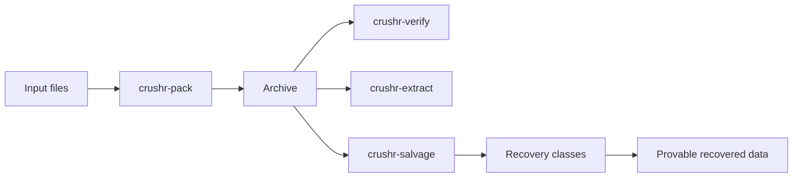

# crushr

**crushr** is an experimental, integrity-first archive and compression format built around a different question than most file containers:

> When an archive is damaged, what can still be *proven* and *recovered*?

Most archive formats assume the container remains structurally intact. If central metadata is corrupted, extraction tends to fail hard. crushr explores a different approach: the archive should degrade gracefully, and surviving data should remain recoverable whenever it can still be cryptographically verified.

## Who crushr is for

crushr is aimed at people who care more about **verifiable recovery** than convenience:

- storage and archival engineers
- preservation and research workflows
- DFIR / forensic practitioners
- anyone experimenting with corruption-tolerant data packaging

It is **not** trying to replace ZIP or TAR for everyday use.

## Core idea

Traditional archive design looks like this:

```text
metadata defines structure
payload is interpreted through metadata
metadata loss means archive failure
```

crushr is evolving toward this:

```text
payload blocks carry enough local truth to be identified and verified
metadata improves naming, confidence, and convenience
metadata is no longer the single point of truth
```

That inversion is the defining design principle of the project.

## What makes crushr different

### Salvage-first design

crushr is designed with damaged archives in mind. Recovery is not treated as an afterthought.

### Payload-level truth

The strongest resilience signal in crushr comes from **self-identifying payload blocks**. This allows salvage tooling to recover verifiable data even when higher-level metadata is missing or corrupted.

### Evidence-driven evolution

crushr is being shaped by a corruption harness that repeatedly damages archives and measures what still survives. The format is being changed based on test evidence, not just theory.

## Current architectural direction

The project has converged on three major ideas:

1. **Payload blocks should be independently identifiable and verifiable**
2. **Recovery should be classified by what can still be proven**
3. **Metadata should be treated as advisory unless experiments prove it is worth the cost**

## Recovery model

The salvage tool classifies recovery strength using explicit categories:

- **Full named verified** — complete recovery with trusted name/path
- **Full verified** — complete recovery without trusted naming
- **Partial ordered verified** — partial data recovered in provable order
- **Partial unordered verified** — partial data recovered but ordering cannot be proven
- **Orphan evidence only** — verified fragments exist but cannot be reconstructed into a file
- **No verified evidence** — nothing salvageable remains

## Why this matters

In traditional archives, small structural corruption can cause catastrophic failure. crushr is exploring whether that failure model is necessary.

If the container is damaged but the surviving data can still prove what it is, then the archive can still be useful.

## Project status

crushr is active research software. The format, metadata model, and recovery strategy are still being refined. The strongest result so far is that **self-identifying payload blocks matter much more than traditional metadata duplication**.

## Simple mental model



## Read next

Continue to [Testing Harness](testing-harness.md) for a detailed explanation of how crushr is being evaluated under corruption and how the harness drives format design.