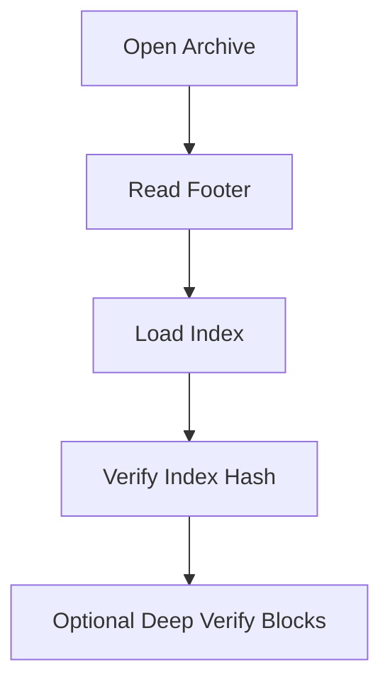

# Operations and Verification

This is the operator-facing view: how to validate archives and handle corruption.

## Integrity Model
- Index is verified using footer hash during open.
- Optional deep verify re-reads blocks and validates per-block hashes (when enabled).

## Recovery
Recovery mode performs best-effort scanning for known footer/block markers and attempts to reconstruct an index for extractable entries.
