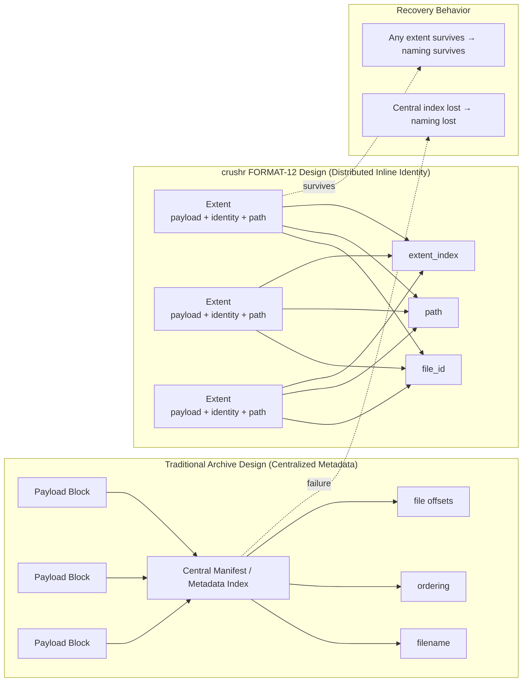

# FORMAT-12: Distributed Inline Naming Breakthrough

FORMAT-12 produced one of the most decisive experimental results in the crushr research program.

The experiment tested whether file naming information could be distributed directly into each verified extent identity record instead of relying on centralized metadata structures such as manifests.

The goal was simple:

> Recover the naming benefits of metadata without paying the structural and size penalties of centralized metadata systems.

The results exceeded expectations.

---

# Experimental Question

Previous experiments showed:

- `payload_only` and `extent_identity_only` produced mostly anonymous recoveries.
- Manifest-based designs restored file names but dramatically increased archive size.
- Centralized metadata structures introduce structural recovery dependencies.

FORMAT-12 tested a new variant:

```text
extent_identity_inline_path
```

Each extent identity record contains:

- file_id
- extent_index
- extent_count
- payload verification linkage
- path/name information

This distributes naming truth across the archive rather than centralizing it.

---

# Results

| Variant                           | Named Recoveries | Archive Size | Overhead vs payload |
| --------------------------------- | ---------------- | ------------ | ------------------- |
| payload_only                      | 2                | 51,808       | baseline            |
| extent_identity_only              | 2                | 52,000       | +192                |
| extent_identity_inline_path       | **12**           | **54,280**   | **+2,472**          |
| extent_identity_distributed_names | 12               | 75,312       | +23,504             |
| payload_plus_manifest             | 12               | 86,888       | +35,080             |
| full_current_experimental         | 12               | 109,984      | +58,176             |

Key observations:

- `extent_identity_inline_path` restored **100% of the named recovery capability** seen in metadata-heavy variants.
- It did so while increasing archive size by only **~4.7%** over `payload_only`.
- Manifest-based approaches required **67%+ archive expansion**.

---

# Recovery Efficiency

FORMAT-12 introduced a simple efficiency metric:

```text
named_recoveries_gained / KB_overhead
```

| Variant                           | Recovery per KB Overhead |
| --------------------------------- | ------------------------ |
| extent_identity_inline_path       | **4.49**                 |
| extent_identity_distributed_names | 0.44                     |
| payload_plus_manifest             | 0.29                     |
| full_current_experimental         | 0.18                     |

Inline naming is **an order of magnitude more efficient** than the alternatives.

---

# Structural Implication

The experiment reveals a key architectural insight:

Centralized metadata was not valuable because it stored large quantities of information.

It was valuable because it preserved **file naming truth**.

Embedding that truth directly into each verified extent:

- removes reliance on centralized metadata
- dramatically improves corruption resilience
- restores named recovery
- keeps archive size low

This aligns strongly with the core crushr design philosophy:

> Distribute verifiable truth rather than centralize it.

---

# Format Evolution Impact

Based on FORMAT-12 results:

- `extent_identity_inline_path` becomes the **primary candidate identity surface**
- `extent_identity_only` is demoted to **legacy research variant**
- manifest-heavy variants remain useful for research comparison but are no longer favored

Final promotion to canonical design will occur after stress testing.

---

## Centralized Metadata vs Distributed Identity


