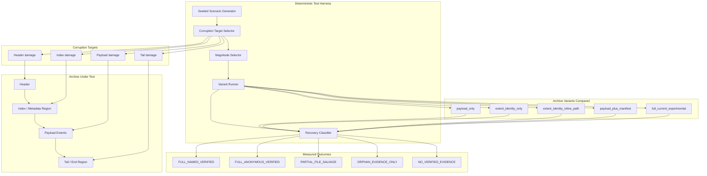

## Why FORMAT-12 Matters

FORMAT-12 was not a subjective design debate or a hand-wavy architectural preference.

It was a controlled experiment asking a very specific question:

> Can crushr recover the naming benefits of metadata without paying the size and structural fragility costs of centralized metadata?

The answer was yes.

`extent_identity_inline_path` matched the named recovery performance of the metadata-heavy variants while remaining dramatically smaller. That makes FORMAT-12 one of the strongest results in the crushr research program so far.

---

## Centralized Metadata vs Distributed Identity

Traditional archive designs usually separate payload from naming truth.

**Figure:** Traditional archive formats rely on centralized metadata to map payload blocks to filenames. In crushr’s FORMAT-12 design, each extent carries its own identity and naming information, allowing file reconstruction even when global metadata structures are damaged.

The architectural difference is simple but important:

- Traditional model: `payload -> central metadata -> file name`
- FORMAT-12 model: `payload -> local verified identity -> file name`

That shift removes a major single point of failure.

---

## Deterministic Corruption Harness

The FORMAT-12 result matters because it was produced under the same deterministic corruption harness used throughout crushr research.

Each archive variant was subjected to repeatable corruption against specific archive regions, then salvage outcomes were classified using the same rules. That makes the comparison evidence-driven rather than anecdotal.

**Figure:** crushr evaluates archive designs with a deterministic corruption harness. Each variant is subjected to repeatable damage against specific archive regions, then salvage outcomes are classified using the same rules so recovery behavior and overhead can be compared objectively.

This is why the FORMAT-12 result is so compelling: the inline-path design did not merely look elegant on paper. It won under controlled conditions.

---

## Why Inline Naming Performed So Well

The strongest interpretation of FORMAT-12 is that the metadata-heavy designs were not winning because they contained a large amount of metadata.

They were winning because they preserved one very valuable thing:

**verified naming truth**

Once that truth was moved into the local extent identity surface, the design kept the recovery benefit while dropping most of the centralized overhead.

That worked well for three structural reasons.

### 1. Naming truth became local instead of centralized

When a manifest or metadata index is damaged, naming often disappears even if payload survives.

With inline identity, each verified extent can still carry:

- file identity
- ordering signal
- path/name truth

That means recovery no longer depends on one surviving central structure.

### 2. Path strings are small relative to payload

Even when duplicated, path/name data is usually tiny compared with file content.

For many real archives:

- payload sizes are measured in kilobytes or megabytes
- path strings are measured in tens or low hundreds of bytes

So duplicating path truth locally often costs only a few percent, while dramatically improving recovery resilience.

### 3. The design avoids a large central bookkeeping surface

Manifest-heavy designs tend to accumulate:

- file listings
- object ordering
- offsets
- linkage structures
- recovery bookkeeping

Inline path identity avoids much of that. It carries only the truth needed at the local extent level.

That is why FORMAT-12 achieved the same named recovery headline as manifest-bearing variants without paying anything close to manifest-bearing size costs.

---

## How Common Is This Pattern?

No, crushr did not discover a secret that thousands of engineers somehow missed while staring directly at it for decades.

What crushr validated is a known design pattern applied in a context where older archive formats usually did not prefer it.

Related ideas already exist in:

- content-addressed storage systems
- chunked backup systems
- self-describing segmented containers
- some log-structured and object-based storage designs

What is less common is seeing this pattern used as the primary answer to **archive salvage resilience** in a compression-oriented archive format.

Older archive formats were designed under different constraints:

- storage was expensive
- metadata duplication was treated as waste
- recovery from corruption was often secondary to normal extraction

Modern storage economics make a different trade-off reasonable:

> duplicate a small amount of high-value truth to avoid losing naming when centralized structures fail

FORMAT-12 shows that this trade-off is not only reasonable for crushr, but highly effective.

---

## Research Impact

FORMAT-12 materially changes the direction of the project.

Based on current evidence:

- `extent_identity_inline_path` is the leading identity-layer candidate
- `extent_identity_only` is demoted to a legacy research variant
- manifest-heavy variants remain useful as comparison controls, but no longer define the preferred direction

The remaining open question is not whether inline naming works.

The remaining open question is whether it remains efficient under adversarial path duplication and fragmentation stress.

That is the purpose of the next bounded experiment.

---

## Next Step: FORMAT-12-STRESS

FORMAT-12 proved that distributed inline naming can match manifest-grade named recovery at a tiny overhead cost in the current corpus.

The next experiment isolates the one realistic failure mode still worth worrying about:

- deeply nested paths
- very long filenames
- highly fragmented files
- repeated path duplication across many extents

If inline naming remains efficient there as well, it becomes the strongest candidate yet for crushr’s structural identity layer.
