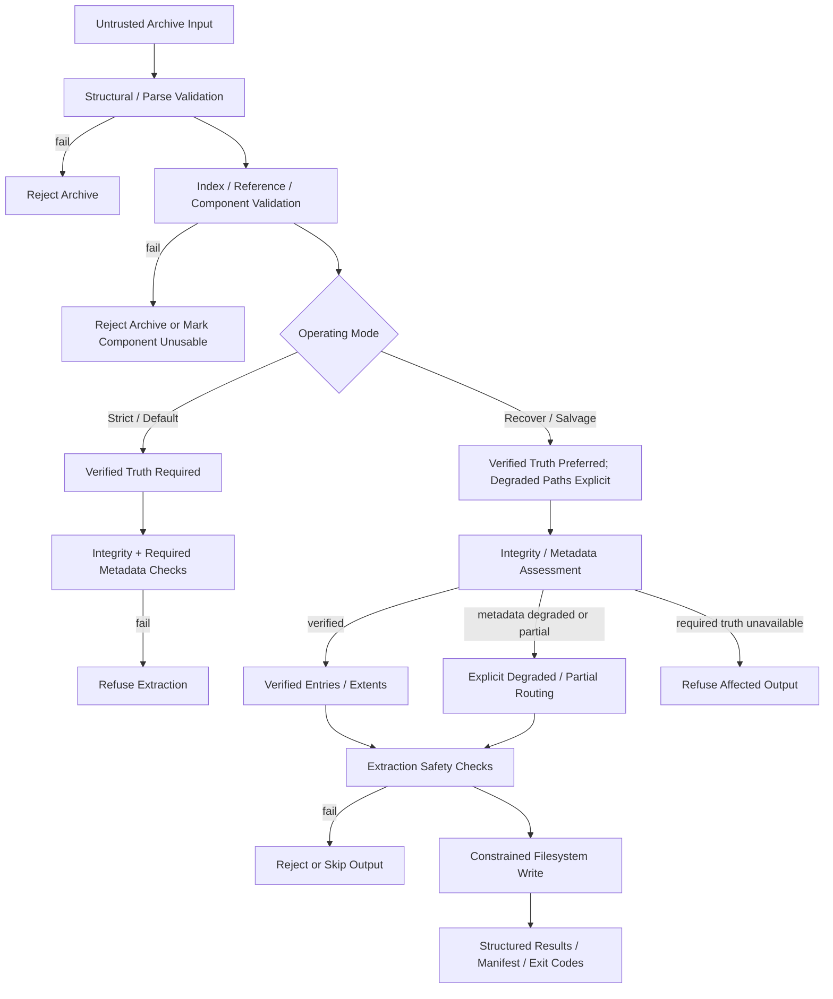

# Security Architecture

This diagram is a **high-level security architecture view**, not a literal control-flow graph. It shows where crushr establishes trust, where strict and recovery policies diverge, and where output safety is enforced before filesystem writes occur.

## Interpretation

### Trust Establishment
crushr treats all archive input as hostile until structural, reference, and integrity checks establish enough truth for the requested operation.

### Validation Stages
The system validates in layers:
- structural / parse correctness
- index, reference, and component consistency
- integrity of components required for the requested operation
- metadata and extraction-safety checks appropriate to the active mode

These are not interchangeable. Earlier failures prevent later trust-bearing work.

### Mode Split
#### Strict / Default Mode
- requires verified truth for the requested operation
- refuses extraction when required integrity or required metadata cannot be established
- does not downgrade silently

#### Recover / Salvage Mode
- is explicitly opt-in
- prefers verified truth
- may route affected items into explicit degraded / partial outcomes when policy permits
- refuses affected output when required truth is unavailable
- never presents degraded recovery as full success

### Output Safety Boundary
Even verified or explicitly degraded recovery paths must pass extraction-safety checks before any filesystem write occurs. Path confinement and write-target checks remain mandatory regardless of mode.

## Enforcement Points

| Stage | Enforced Invariants |
|------|--------------------|
| Structural / Parse Validation | I6, I8 |
| Integrity and Component Validation | I1, I5 |
| Strict Failure Paths | I2, I10 |
| Recover / Salvage Routing | I3, I7, I10 |
| Extraction Safety Boundary | I9 |
| Structured Output / Exit Codes | I3, I10 |

## Key Properties

### No Unverified Data Flow
There is no trust-bearing path from input to output that bypasses the relevant validation for the active mode.

### Explicit Degradation
Recovery-capable paths are explicit, policy-bound, and reported. crushr does not collapse degraded states into ordinary success.

### Controlled Materialization
Filesystem writes occur only after validation, policy checks, and path-confinement checks succeed.

## Summary

crushr enforces a validation-first, mode-aware architecture:
- input is hostile
- trust is established in layers
- strict mode requires verified truth
- recovery mode makes degradation explicit
- output is trustworthy, explicitly degraded, or absent
