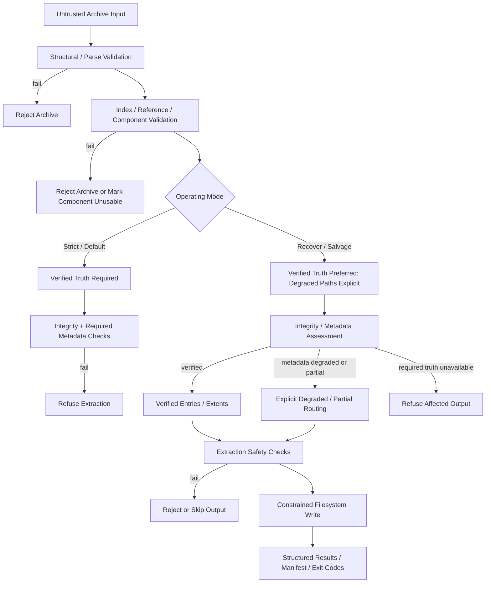

<!--
SPDX-License-Identifier: CC-BY-4.0
SPDX-FileCopyrightText: 2026 Richard Majewski
-->

# Security Architecture

## Intent

This page defines the security-relevant control flow and architectural trust boundaries of crushr.

## Guarantees

- Verified data is never silently corrupted or misrepresented
- Unverifiable data is never presented as valid
- Degraded or partial results are explicitly labeled and structured
- Archive processing fails closed when required truth cannot be established
- Filesystem writes are constrained and cannot escape intended boundaries

## Behavior

### Control flow

```mermaid
flowchart TD

    A["Untrusted Archive Input"] --> B["Structural / Parse Validation"]
    B -->|fail| X1["Reject Archive"]

    B --> C["Index / Reference / Component Validation"]
    C -->|fail| X2["Reject Archive or Mark Component Unusable"]

    C --> D{Operating Mode}

    D -->|Strict / Default| E["Verified Truth Required"]
    D -->|Recover / Salvage| F["Verified Truth Preferred; Degraded Paths Explicit"]

    E --> G["Integrity + Required Metadata Checks"]
    G -->|fail| X3["Refuse Extraction"]

    F --> H["Integrity / Metadata Assessment"]
    H -->|verified| I["Verified Entries / Extents"]
    H -->|metadata degraded or partial| J["Explicit Degraded / Partial Routing"]
    H -->|required truth unavailable| X4["Refuse Affected Output"]

    I --> K["Extraction Safety Checks"]
    J --> K

    K -->|fail| X5["Reject or Skip Output"]
    K --> L["Constrained Filesystem Write"]

    L --> M["Structured Results / Manifest / Exit Codes"]
```

### Validation layers

The system evaluates archives in layers:

1. structural validation
2. index and reference validation
3. integrity verification
4. metadata and policy assessment
5. extraction safety enforcement

### Mode behavior

#### Strict / default

- requires canonical extraction conditions
- refuses output when required truth cannot be established
- never routes degraded output into ordinary success

#### Recover

- permits explicit non-canonical routing only within policy boundaries
- preserves trust classification rather than flattening outcomes into success
- never presents degraded recovery as canonical extraction

### Extraction safety boundary

Even canonical or explicitly classified recovery paths must pass extraction-safety checks before any filesystem write occurs. Path confinement and write-target checks remain mandatory regardless of mode.

### Architectural invariants relationship

| Control Path | Relevant Invariants |
|---|---|
| Validation Before Use | I1, I2, I5 |
| Recover Routing | I2, I3, I7, I10 |
| Extraction Safety | I9, I10 |
| Explicit Classification | I3, I4, I10 |

## Boundaries / Non-goals

This page does not define user workflow, benchmark behavior, or historical terminology. It defines the security-relevant architecture only.

Non-goals:

- No best-effort reconstruction
- No hidden failure smoothing
- No compression-first tradeoffs
- No external decode dependencies

## Summary

Recovery-capable paths are explicit, policy-bound, and reported. crushr does not collapse degraded states into ordinary success.
