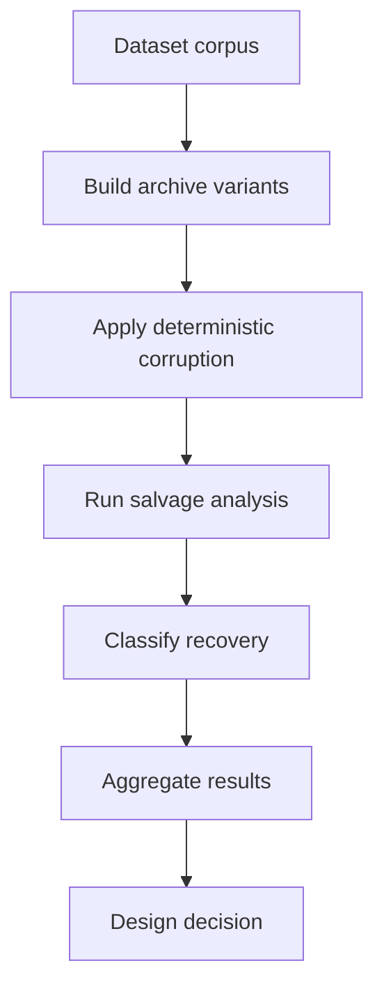
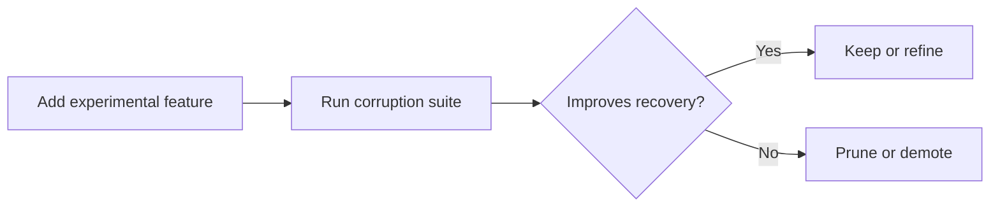

# Testing Harness

crushr includes a purpose-built corruption harness used to answer a simple question:

> Which parts of the archive design actually improve recoverability, and which parts only add complexity?

This harness is one of the most important parts of the project. It is how crushr moves from speculation to evidence.

## What the harness does

At a high level, the harness:

1. builds deterministic archive variants
2. applies controlled corruption
3. runs salvage analysis
4. classifies what remains recoverable
5. compares format variants against each other

## Why the harness exists

Most archive formats are designed around intact containers. crushr is explicitly testing damaged ones.

The harness makes it possible to ask questions like:

- Does self-identifying payload data improve recovery?
- Do extra metadata layers survive often enough to justify their size?
- Does metadata placement matter?
- When does recovery downgrade from named to anonymous or orphaned?

## High-level workflow



## Corpus used by the harness

The harness operates on a bounded set of representative dataset shapes:

- **smallfiles** — many small items and metadata-heavy structure
- **mixed** — a blend of file sizes and types
- **largefiles** — fewer large payloads where block-level recovery matters more

These profiles are useful because different archive strategies can succeed or fail differently depending on the dataset shape.

## Core corruption families

The harness started with simple structural damage targets:

- **header damage**
- **index damage**
- **payload damage**
- **tail truncation**

As crushr evolved, later phases introduced richer corruption families targeting metadata survival and graph reasoning.

## Recovery classes used by salvage

The harness records recovery using the recovery classes exposed by the salvage engine.

| Class | Meaning |
|---|---|
| `FULL_NAMED_VERIFIED` | Complete recovery with trusted name/path |
| `FULL_VERIFIED` | Complete recovery without trusted name/path |
| `PARTIAL_ORDERED_VERIFIED` | Partial recovery with provable order |
| `PARTIAL_UNORDERED_VERIFIED` | Partial recovery without proven order |
| `ORPHAN_EVIDENCE_ONLY` | Verified fragments with no file reconstruction |
| `NO_VERIFIED_EVIDENCE` | Nothing salvageable remains |

These classes matter because crushr is not just measuring “did extraction succeed?” It is measuring **what level of truth still survives**.

## Format research phases

The harness has been used to evaluate several experimental format directions.

### FORMAT-05 — self-identifying payload blocks

This phase introduced payload blocks that carry local truth about what they belong to.

**Result:** this was the biggest structural win so far. Recovery improved substantially because surviving payload blocks could still be identified even when metadata was damaged.

### FORMAT-06 — file manifests

This phase added file-level structural truth to improve recovery confidence and completeness classification.

**Result:** useful for richer reasoning, but not the main source of recovery gains.

### FORMAT-07 — graph-aware salvage reasoning

This phase changed the salvage engine so it reasons over surviving verified relationships instead of flat metadata checks.

**Result:** richer and more explicit classification, with stable behavior across scenarios.

### FORMAT-08 — metadata placement strategies

Three metadata placement strategies were compared:

- `fixed_spread`
- `hash_spread`
- `golden_spread`

**Result:** no measurable difference. Metadata never survived in the tested scenarios, so placement had no effect.

### FORMAT-09 — metadata survivability and necessity audit

This phase directly tested whether metadata layers survive often enough to matter.

**Result:** metadata survival counts remained effectively zero, strongly suggesting that the real resilience mechanism is payload truth rather than traditional metadata.

## What the harness has revealed so far

The biggest lesson from the experiments is this:

```text
the archive's recoverability is being driven by self-identifying payload blocks,
not by duplicated metadata surfaces
```

That has pushed the project toward simplification rather than accumulation.

## Why this is unusual

In most archive formats:

```text
metadata is authoritative
payload depends on metadata
```

In crushr's emerging model:

```text
payload proves what it is
metadata helps when it survives
```

This is a meaningful difference in how recoverability is approached.

## Harness outputs

The harness generates compact machine-readable and human-readable summaries.

Typical outputs include:

- comparison summary JSON
- comparison summary Markdown
- grouped results by dataset
- grouped results by corruption target
- recovery class distributions
- metadata survival statistics

These outputs are used to decide whether a design change should be kept, changed, or removed.

## Example decision loop



This is how crushr is being shaped into something smaller and more evidence-driven over time.

## What comes next

The next pruning and simplification phases use the harness to answer:

- Which metadata layers are actually necessary?
- Which are just archive overhead?
- What is the minimal truth surface needed for strong recovery?

That is the direction the project is currently heading.

## Practical takeaway

If you only remember one thing about the harness, make it this:

> crushr is not being designed by theory alone. It is being designed by repeatedly breaking archives and measuring what still lives.
