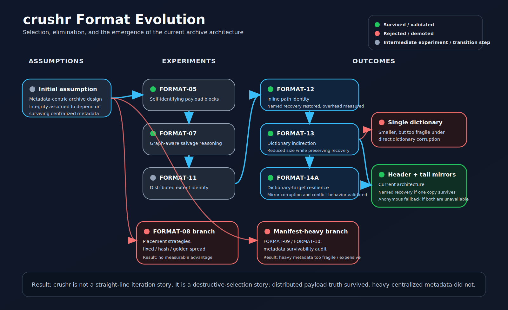
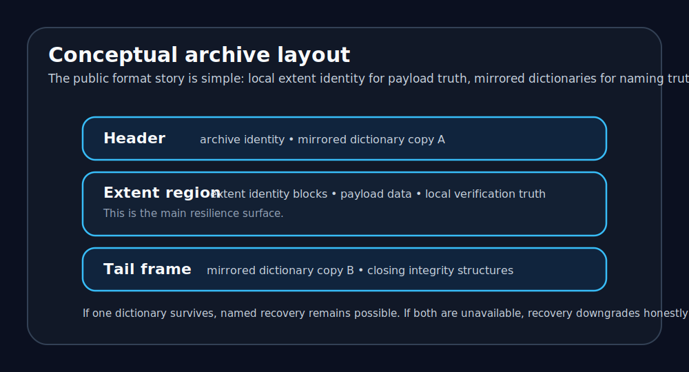

# Format architecture

  <strong>The guiding rule.</strong> The archive should not depend on a single structure to explain what its surviving data means.

  
  
The current architecture emerged by eliminating weaker branches rather than by decorating an original design.

## Core layout

A crushr archive is organized around four conceptual regions.

| Region | Purpose |
|---|---|
| Header | Archive identity plus mirrored dictionary copy A |
| Extent region | Extent identity and payload data |
| Structural indexes / tables | Compact layout support as required by the implementation |
| Tail frame | Mirrored dictionary copy B |

  

## Extent identity

The extent identity system is the main resilience mechanism. Each surviving extent carries enough verified local truth to answer three questions without depending on a central naming surface: which file it belongs to, where it belongs in that file, and whether its payload still verifies.

## Naming dictionaries

Names are resolved through dictionary copies stored at the header and tail. This gives the archive three useful states.

1. If one valid copy survives, named recovery remains possible.
2. If both copies are unavailable, recovery continues anonymously.
3. If the copies disagree and policy cannot resolve the disagreement safely, naming fails closed.

  <strong>Why this structure matters.</strong> The mirrored dictionary model is materially smaller than the heavier manifest-centric alternatives that were tested and materially more resilient than a single dictionary surface.

  <strong>Current lead candidate.</strong> FORMAT-15 tested a factored namespace refinement and generation-aware dictionary identity, but the submitted baseline and stress runs did not show a size win over the existing mirrored dictionary design. The active lead architecture therefore remains the non-factored header+tail mirrored dictionary model.

