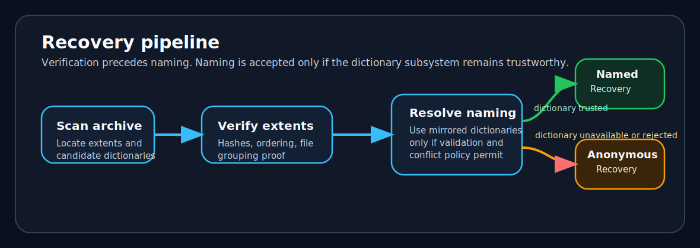

# Recovery and integrity model

crushr treats recovery as a classification problem rather than a binary success/failure outcome.

  
  
Verification precedes naming. Naming is accepted only if the dictionary subsystem remains trustworthy.

## Recovery classes

| Class | Meaning |
|---|---|
| Named recovery | Complete recovery with trusted naming and verified structure |
| Anonymous recovery | Complete structural recovery without trusted naming |
| Partial ordered recovery | Missing data, but ordering still provable |
| Partial unordered recovery | Fragments recovered without provable ordering |
| Orphan evidence | Verified fragments exist but are insufficient for file reconstruction |
| No verified evidence | Nothing usable remains |

## Anonymous fallback

Anonymous fallback is one of crushr’s defining behaviors. In many damaged archives, the payload survives more readily than naming metadata. If the tool treated lost names as total failure, it would discard useful verified data. If it guessed names, it would weaken trust. Anonymous fallback keeps what can still be proven and labels it honestly.

## Dictionary corruption behavior

  
  
The mirrored dictionary system preserves named recovery when one copy survives, falls back anonymously when both are unavailable, and fails closed when mirrors conflict.

  <strong>The trust boundary is simple.</strong> crushr will preserve payload without names, but it will not preserve names without proof.

